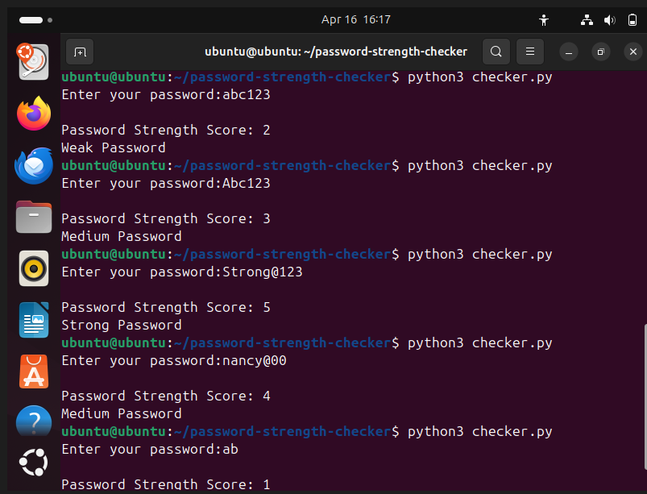

# Password Strength Checker

# Description
A simple Python tool that checks password strength based on security rules.

# Features
- Checks length of password
- Checks uppercase letters
- Checks lowercase letters
- Checks numbers
- Checks special characters

# How to Run
1. Run the file using: python3 checker.py
2. Enter password
3. Get strength result

# Output Screenshot

# Learning Outcome
- Python basics
- Regex usage
- Cybersecurity password awareness
